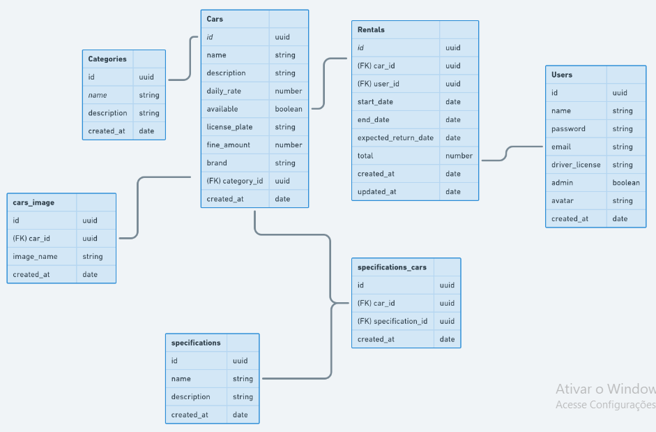
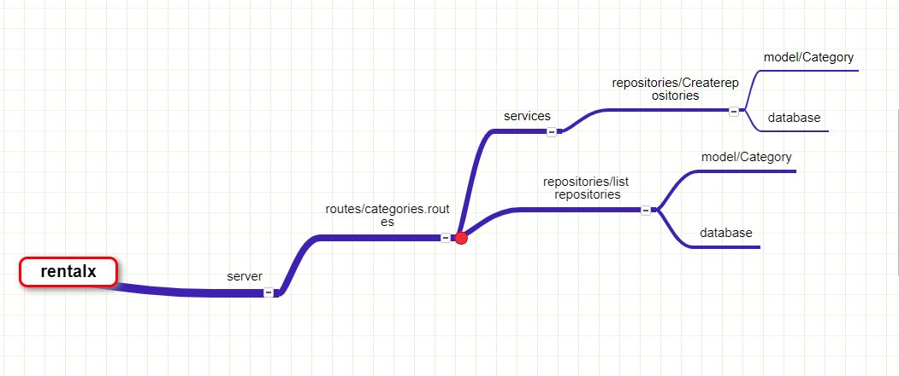

# Projeto Rentalx Cadastro de Veiculos

## Objetivo

Este é uma aplicação em Nodejs de nivel esperimental, de um sistema de cadastro de carros.

## Esquematização de logica de funcionamento

repositories
-CategoriesRepositories.ts

routes
-categories.routes.ts

services
-CreateCategoryService.ts

-----------------------------------------

class NomedaClass {
	private/publica variavel

	constructor(){
	
	}

	verbo(){

	}
}

export {NomedaClass}

new NomedaClasse()

## Aquitetura de Desenvolvimento

Código limpo é um conceito muito importante, isso representa dar nomes declarativos a constantes e funções, que decreve o que está acontecendo.

Código Limpo e SOLID são conteitos que pode definir o codigo limpo e organizado.

S => SRP - Single Responsability Principle(Principio da Responsabilidade Unica)

O => OCP - Open-Closed Principle (Principio aberto/fechado)

L => LSP - Liskey Substitution Principle (Principio da Segregação de Interface)

I => ISP - Interface Segregation Principle (Principio da Segregação de Interface)

D => DIP - Dependency Inversion Principle (Principio da Inversão de Dependencia)

## Passos

1- Exercutar o yarn init --y, para criar o package.json

2- yarn add typescript -D e yarn tsc --init, configuração de tipagem e uso.

3- yarn add express e yarn add @types/express -D, para instalar o framework de rotas o express com sua tapagens.

4- Instalar o EsLint e o Prettier, para padronização do código. Eles vão servir para quando muitos desenvolvedores trabalharem no mesmo codigo possa existir uma padrinização.

NoEsLint conseguimos definir interface, forçando qua a interface de tipagem comece com I, definir as regras de projetos especificos entre outras definições.

yarn add eslint -D, baixar o eslint como uma dependencia de desenvolvimento.

yarn eslint --init, para adicionar as cofigurações dentro do projeto, seguir os passos:

-To check syntax, find problems and enforce code style( How would you like do use Eslint?)
-JavaScript modules(import/export)(What type of modules does your project use?)
-None of these(Which framework does your project use? )
-Yes(Does your project use TypeScript?)
-Node(Where does your code run?)
-Use a popular style guide(How would you like to define a style for your project?)
-standard-with-typescript( Which style guide do you want to follow? )
-JSON(What format do you want your config file to be in?)
-No(Would you like to install them now with npm?)

Precisamos também instalar um plugin que irá nos auxiliar a organizar a ordem dos imports dentro dos arquivos e outro para permitir importações de arquivos TypeScript sem que precisemos passar a extensão do arquivo:

yarn add -D eslint-plugin-import-helpers eslint-import-resolver-typescript

Com as dependências instaladas vamos criar na raiz do projeto um arquivo .eslintignore com o conteúdo abaixo para ignorar o Linting em alguns arquivos:

/*.js
node_modules
dist

Precisamos configurar o plugin

"plugins": [
        "eslint-plugin-import-helpers"
    ],

Adicionamos dentro de "rules"

Segui no .eslintrc.json

Para que o Node.js consiga entender arquivos Typescript é necessário acrescentar uma configuração adicional nas importações pois por padrão vai ser apresentado um erro dizendo que as importações de arquivos Typescript não foram resolvidas. Para resolver isso basta adicionar logo abaixo das "rules" no .eslintrc.json o seguinte:

"settings": {
    "import/resolver": {
      "typescript": {}
    }
  }

5- yarn add ts-node-dev -D, lib para fazer a execução do codigo em desenvolvimento. Em seguida ir em packge.json e criar um 

stript -> "dev": "ts-node-dev --transpile-only --ignore-watch node_modules --respawn src/server.ts".

6- debug da aplicação, foma de acessar variaveis e atributos e verseu funcionamento.

percionar o vscode icon de play com inseto -> crie um arquivo launch.json -> nodejs -> mudar "type": "node" -> "request": "attach" -> iniciar o servidor -> play, na parte superior do debug, erro de carregamento(vai ser infinito, para isso adicionar no package.json no script de dev "--inspect" ) -> executar dev

7- Referenciado no esquema de criação de funcionalidades, vamos criar tabelas como categorias, carros. Inicalmente vamos criar a tabela de categoria.

Incialmente vamos criar uma pasta de routes
arquivo categories.routes.ts, onde será armazenadas as rotas da aplicação.

7- yarn add uuid, vai servir para gerar numero de identificado unico para cada cadatro realisado.

8- Mas se agente for ver agente pode passar qualquer informação no envio dos dados para a memoria, pois não ter nenhum formato definido para a categoria, não possui um modelo.

Criar pasta Model com arquivo Category.ts, no modelar criar um contructor para o uuid, tornando a atribuição uuid opcional. 
(!this.id){
  this.id = uuidv4()
}.

Depois tipar(importando do Model a tipagem esperado) os dados que serão recebido no array. Por sua vez na nvariavel com armazena os dados recebidos do body, mudar seu valor, ao inves de receber os dados, passar a instaciação do com new Categody e em seguida cria um metodo logo abaixo: Object.assign(category, {dados recebidos})

9- Uso de Repositorios, é a camada(classe) responsavel por fazer toda a manipulação dos dados da aplicação, sendo responsaveis por fazer o acesso ao banco de dados, insert, select no banco de dados.

Criar pasta repositories, arquivo CategoriesRepositories.ts que vai possui o codigo:

10- Validando nome da categoria para evitar duplicação

11- SOLID, o primeiro conceitos que vamos utilizar é o S, Principio da Responsabilidade Unica, então vendo a pasta de routes -> cotegories.routes.ts temos muito responsablidade para essa rota que vão em desacordo comeset principio. 

Para isso vamos criar uma pasta de services , para ter a responsabilidade de criar a categoria validando ela.

services -> CreateCategoryService.ts
criar metodo execute() e colocar todo o codigo validação e cadastro. Criar interface para tipagem de dados, nome e description.

Será trabalhado as seguintes competencias:
-Definir o tipo de retorno
-Alterar o retorno de erro
-Acessar o repositorio
-Retornar algo

12 - Segundo Pincipio, D, Principio da Inversão de Dependencia. Esse principio diz que o codigo que implementa uma politica de alto nivel não deve depender do codigo que implementa detalhes de baixo nivel.

O Service não precisa saber qual que é o tipo do repositorio, ele é o alyo nivel da aplicação é aquela que esta mais perto de dominio e as rotas é a de baixo nivel. Nessa aplicação o verviço que vau ser delegado para o service é o criete(criar) eo findbyname(encontre o nome). 

13- Principio L, Principio da Substituição de Liskov(LSP), esse é um dos pricipios mais faceis de entender e muito simples de usar. Na documentação, ele diz que para você criar um sistema de software, as partes intercambiaveis deve aderir a um contrato que perm ita que elas sejam substituidas umas pelas outras em que haja um impacto no sistema. 

Na aplicação trabalhada, nesse comomento estamos trabalhando com a memoria em array, ou local. Hoje o CreateCategory ta muito ligado ao Repositorio. No caso de existir a necessiadade  de mudar para um outro banco de dados, agente teria que mudar a impletação dentro do contrutor do Repositories.

Umas das formas de fazer isso é com uma interface.

Segue os passos para essa etapa:

1- Criar um ICategoriesRepository, que vai conter os metodos os CategoriesRepository. Create, list, findByName.

2- Criar um novo arquivo que supostamente vai ser a nova conexão com o Banco de dados, aqui vamos chamar de PostgresCategoriesRepository. Em segui na logo depois de escrever o nome da classe digitar implements para utilisar as implamenteção do contrato craindo anteriomente(ICategoriesRepository). Precione ctrl mais . ensima do noma da classe para tudo aparecer altomaticamente.

3- Implementar o ICategoriesRepository em CategoriesRepository. Tirar a interface ICategoriesRepositoryDTO e passar para o arquivo ICategoriesRepository. Em seguida desestrurura dados em CategoriesRepository e PostgresCategoriesRepository para corrigir erro e funcionar normalmente.

14- Vamos trabalha na especificação(specification). Criar model para especificação, com os mesmos atributos(ou entidados) que a de Category.

15- Criar um CreateSpecificationService, para disponibilizar a criação de espeficicações independende do nivel em que é implementado.

16- Criar o Rrepositories de Specification, ISpecificationRepository e o SpecificationRepository.

17-  Como forma de organizalção e estruturação vamos criar modulos. Na Pasta de modules vamos criar uma paste de cars onde ficarão as pastas de models, repositories e services.

18 - Em ISpecificationRepository criar os metodos de uso, em seguido criar o SpecificationRepository já implementando a interface de uso. Em seguida instaciar o model Specification criando seu array data base.

19- Criar o Service de Specification, que será responsavel por criar a valiudade especificações criadas.

20- Criar ``rota`` de specifications

21- Criar pasta dentro cas com o nome de useCases, onde será responsavel por conter as regras de negocios da aplicação.